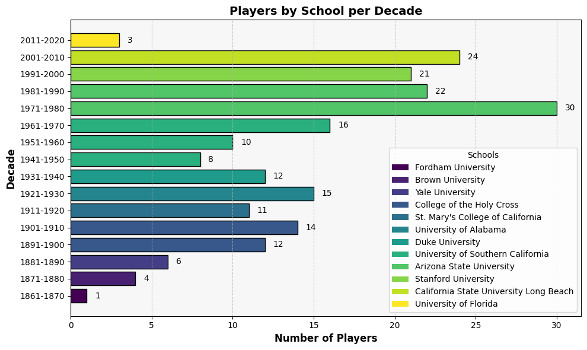

## Introduction
I'm thrilled to share my latest SQL project analyzing Major League Baseball (MLB) data ⚾. The project explores four key areas: school and player demographics, salary trends, player career longevity, and physical characteristics. I chose this dataset to move beyond basic joins and practice more advanced SQL techniques, such as window functions and complex subqueries, to answer questions like:

1. How has the average player's height and weight changed over the decades?
2. Which teams consistently rank in the top 20% for player salaries?
3. What is the career length of different players, and how many played for over a decade with the same team?

This project was a fantastic way to apply my skills to a rich, real-world dataset and uncover some truly interesting insights. Looking forward to sharing my findings!

SQL code to check answers on above queries available by clicking here: [Baseball Players](https://github.com/mknysiak/MySQL/blob/main/MySQL_Project.sql)  

## Tools which were used
Below are listed tools which were used to find out the answers on above questions:

- ⚙️**MySQL Server/Workbench:** This was my chosen environment for storing and managing the database, providing a robust platform for efficient data manipulation.
- 💻**Visual Studio Code:** Used this IDE to write and manage my SQL scripts, seamlessly integrating with Git for version control.
- 🌐**Git & GitHub:** These platforms were essential for managing project versions, documenting my process, and making the entire codebase publicly accessible for transparency and future reference.

## Analysis
Lets dive into the analysis and findings from the MLB dataset. This section is divided into three main parts, each addressing a specific aspect of the data. First, we'll explore the demographics of schools and players. Next, we'll analyze salary trends over the years. Finally, we'll look into player career longevity and physical characteristics.

### Schools and Players Demographics
🏫First of all, I wanted to find out how many schools produced MLB players in each decade. As table consisted of PlayerID and SchoolID was used many times, decided to create a Temporary Table.

```sql
CREATE TEMPORARY TABLE grads as
with g as(
SELECT playerid, schoolid, yearid,
	ROW_NUMBER() over (partition by playerid, schoolid order by yearid desc) years
from schools
order by playerid asc
)
select * from g where years = 1;
select * from grads;

with number as(
select count(schoolid) no_of_schools, floor((yearid-1)/10)*10 decade
from grads
group by floor((yearid-1)/10)*10
order by floor((yearid-1)/10)*10
)
select no_of_schools, concat(decade+1,'-',decade+10) decade
from number;
```

*Tab 1. Numbers of school in each decade where players attended*

| Number of Schools | Decade    |
| ------------- | --------- |
| 2             | 1861-1870 |
| 17            | 1871-1880 |
| 49            | 1881-1890 |
| 172           | 1891-1900 |
| 335           | 1901-1910 |
| 389           | 1911-1920 |
| 399           | 1921-1930 |
| 302           | 1931-1940 |
| 249           | 1941-1950 |
| 294           | 1951-1960 |
| 591           | 1961-1970 |
| 984           | 1971-1980 |
| 1325          | 1981-1990 |
| 1333          | 1991-2000 |
| 1076          | 2001-2010 |
| 33            | 2011-2020 |

As we can see above, the number of schools producing MLB players has generally increased over the decades, with a peak in the 1991-2000 decade. However, there is a noticeable drop in the 2011-2020 decade, because the data for this decade is incomplete.

After that, I wanted to identify the top 3 schools that produced the most MLB players in each decade.

```sql
with top3 as(
with number as(
select schoolid, count(playerid) no_of_players , floor((yearid-1)/10)*10 decade
from grads g
group by schoolid, floor((yearid-1)/10)*10
order by floor((yearid-1)/10)*10, count(playerid) desc
)
select *,
	rank() over (partition by decade order by no_of_players desc) ranking
from number
)
select name_full school_name, no_of_players, concat(decade+1,'-',decade+10) decade
from top3
inner join school_details sd on top3.schoolid = sd.schoolID
where ranking in (1,2,3)
order by decade asc, no_of_players desc;
```

*Tab 2. Top school in each decade which produced the most MLB players*



Just to have more readable I chose only the top school for each decade. Overall, the number of players from top schools has varied significantly over the decades, with some schools consistently producing a high number of MLB players. Schools like USC, Arizona State, and Miami have been prominent in multiple decades. Just to have 


