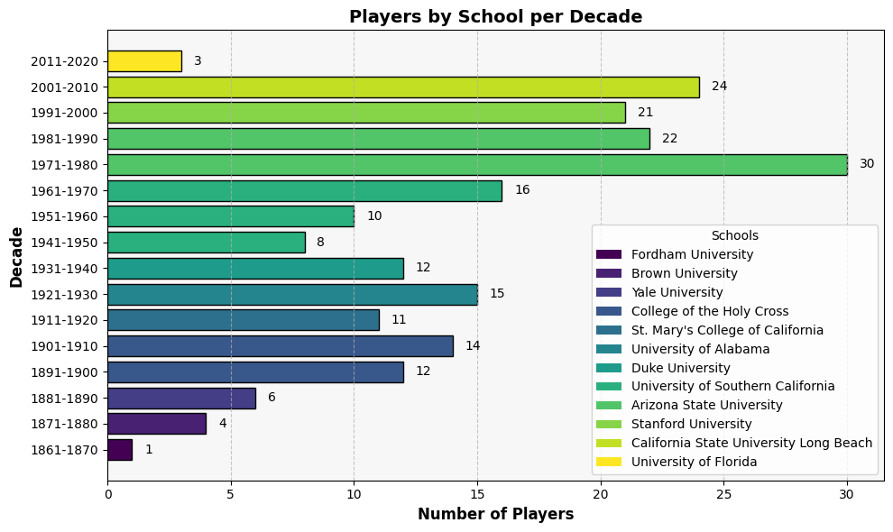
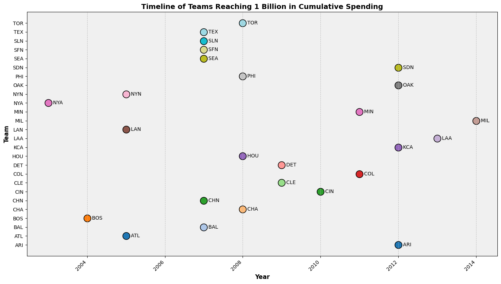
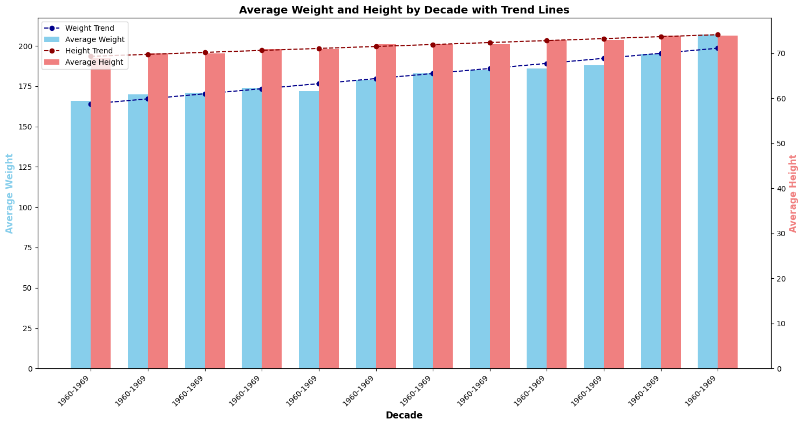

## Introduction
I'm thrilled to share my latest SQL project analyzing Major League Baseball (MLB) data ⚾. The project explores four key areas: school and player demographics, salary trends, player career longevity, and physical characteristics. I chose this dataset to move beyond basic joins and practice more advanced SQL techniques, such as window functions and complex subqueries, to answer questions like:

1. How has the average player's height and weight changed over the decades?
2. Which teams consistently rank in the top 20% for player salaries?
3. What is the career length of different players, and how many played for over a decade with the same team?

This project was a fantastic way to apply my skills to a rich, real-world dataset and uncover some truly interesting insights. Looking forward to sharing my findings!

SQL code to check answers on above queries available by clicking here: [Baseball Players](https://github.com/mknysiak/MySQL/blob/main/MySQL_Project.sql)  

## Tools which were used
Below are listed tools which were used to find out the answers on above questions:

- ⚙️**MySQL Server/Workbench:** This was my chosen environment for storing and managing the database, providing a robust platform for efficient data manipulation.
- 💻**Visual Studio Code:** Used this IDE to write and manage my SQL scripts, seamlessly integrating with Git for version control.
- 🌐**Git & GitHub:** These platforms were essential for managing project versions, documenting my process, and making the entire codebase publicly accessible for transparency and future reference.

## Analysis
Lets dive into the analysis and findings from the MLB dataset. This section is divided into three main parts, each addressing a specific aspect of the data. First, we'll explore the demographics of schools and players. Next, we'll analyze salary trends over the years. Finally, we'll look into player career longevity and physical characteristics.

### Schools and Players Demographics
🏫 First of all, I wanted to find out how many schools produced MLB players in each decade. As table consisted of PlayerID and SchoolID was used many times, decided to create a Temporary Table.

```sql
CREATE TEMPORARY TABLE grads as
with g as(
SELECT playerid, schoolid, yearid,
	ROW_NUMBER() over (partition by playerid, schoolid order by yearid desc) years
from schools
order by playerid asc
)
select * from g where years = 1;
select * from grads;

with number as(
select count(schoolid) no_of_schools, floor((yearid-1)/10)*10 decade
from grads
group by floor((yearid-1)/10)*10
order by floor((yearid-1)/10)*10
)
select no_of_schools, concat(decade+1,'-',decade+10) decade
from number;
```

As we can see below, the number of schools producing MLB players has generally increased over the decades, with a peak in the 1991-2000. However, there is a noticeable drop in the 2011-2020, because the data for this decade is incomplete.

| Number of Schools | Decade    |
| ------------- | --------- |
| 2             | 1861-1870 |
| 17            | 1871-1880 |
| 49            | 1881-1890 |
| 172           | 1891-1900 |
| 335           | 1901-1910 |
| 389           | 1911-1920 |
| 399           | 1921-1930 |
| 302           | 1931-1940 |
| 249           | 1941-1950 |
| 294           | 1951-1960 |
| 591           | 1961-1970 |
| 984           | 1971-1980 |
| 1325          | 1981-1990 |
| 1333          | 1991-2000 |
| 1076          | 2001-2010 |
| 33            | 2011-2020 |

*Tab 1. Numbers of school in each decade where players attended*

After that, I wanted to identify the top 3 schools that produced the most MLB players in each decade.

```sql
with top3 as(
with number as(
select schoolid, count(playerid) no_of_players , floor((yearid-1)/10)*10 decade
from grads g
group by schoolid, floor((yearid-1)/10)*10
order by floor((yearid-1)/10)*10, count(playerid) desc
)
select *,
	rank() over (partition by decade order by no_of_players desc) ranking
from number
)
select name_full school_name, no_of_players, concat(decade+1,'-',decade+10) decade
from top3
inner join school_details sd on top3.schoolid = sd.schoolID
where ranking in (1,2,3)
order by decade asc, no_of_players desc;
```

Just to have the chart more readable, I chose only the top school for each decade. Overall, the number of players from top schools has varied significantly over the decades, with some schools consistently producing a high number of MLB players. Schools like USC, Arizona State, and Miami have been prominent in multiple decades.


*Chart 1. Top school in each decade which produced the most MLB players*

### Salary Trends
💰 In this section I stated two questions on which I wanted to get answers:
 - What is the 20% of annual spending on player salaries for each year by each team?
 - When the team breakdown 1m$ in salaries for the first time?

 Lets start with the first question.

```sql
with avg_annual_salaries as (
with  annual_salaries as (
select teamID, yearid, sum(salary) paid_salaries
from salaries
group by yearid, teamid
)
select teamid, format(round(avg(paid_salaries),0),"N") avg_annual_salaries, 
	ntile(5) over (order by avg(paid_salaries) desc) percentile
from annual_salaries
group by teamid
order by round(avg(paid_salaries),0) desc
)
select teamid, concat(avg_annual_salaries, " $") avg_annual_salaries
from avg_annual_salaries
where percentile = 1;
```

The results show that the top 20% of teams in terms of average annual salaries are significantly outspending others. The New York Yankees lead with an average annual salary of $214,000,000, followed by the Los Angeles Dodgers and Boston Red Sox. This indicates a substantial investment in player talent by these franchises.

| Team | Avg Annual Salaries |
| ------------- | --------- |
| SFG           | 143,510,167 $ |
| LAA           | 118,467,169 $ |
| NYA           | 109,437,311 $ |
| BOS           | 81,090,031 $ |
| LAN           | 74,592,223 $ |
| WAS           | 71,536,002 $ |
| ARI           | 71,175,013 $ |
| PHI           | 66,078,527 $ |

*Tab 2. Teams in the top 20% of average annual salaries*

If we move to the second question, I wanted to find out when each team first broke the $1 million mark in total player salaries for a single year.

```sql
with first as (
with cps as (
with aps as (
select teamID, yearid, sum(salary) paid_salaries
from salaries
group by yearid, teamid
)
select teamid, yearid, paid_salaries,
	sum(paid_salaries) over (partition by teamid order by yearid asc) cum_paid_salaries,
	case 
	when sum(paid_salaries) over (partition by teamid order by yearid asc) > 1000000000 then 1 else 0 end bilion
from aps
order by teamid, yearid
)
select *,
	sum(bilion) over (partition by teamid order by yearid asc) cum_bilion
from cps
)
select teamid, yearid, cum_paid_salaries
from first
where cum_bilion = 1;
```

Unfortunately I do not have the team whole name and only its shorten version. Overall, the analysis reveals that several teams reached the $1 million salary milestone in the early 1990s, with the New York Yankees being the first in 1991. Other teams followed suit throughout the decade, reflecting the increasing financial investment in player salaries during this period.



*Tab 3. Year when each team first broke the $1 million mark in total player salaries*

### Player Teams, Career Longevity and Physical Characteristics
⚾ Finally, I wanted to explore player career longevity and physical characteristics. Specifically, I aimed to answer two questions:
 - What teams did players start and end their careers with?
 - How many players are left, right and both handed?
 - How have the average height and weight of players changed over the decades?

If we begin with the first question, I wanted to find out what teams players started and ended their careers with.

```sql
with first_last as(
with
first as(
select yearid, teamid, playerid,
	ROW_NUMBER() over (partition by playerid order by yearid asc) period
from salaries
order by playerID, yearid
),
last as (
select yearid, teamid, playerid,
	ROW_NUMBER() over (partition by playerid order by yearid desc) period
from salaries
order by playerID, yearid
)
select * from first where period = 1
union all
select * from last where period = 1
)
select concat(namefirst,' ',namelast) name, teamid,
	case
    when ROW_NUMBER() over (partition by p.playerid order by yearid asc) = 1 then '1st Team'
    when ROW_NUMBER() over (partition by p.playerid order by yearid asc) = 2 then 'Last Team'
    end as teams
from first_last
inner join players p on first_last.playerid = p.playerid
order by p.playerid, yearid;
```

The results indicate that a total of 634 players had careers spanning over a decade with the same team. This suggests a significant level of loyalty and long-term commitment between players and their teams in Major League Baseball. Just to show few examples of such players:

| Name | Team | First/Last Team |
| ------------- | --- | --------- |
| David Aardsma | SFN | 1st Team  |
| David Aardsma | NYA | Last Team |
| Don Aase | BAL | 1st Team  |
| Don Aase | NYN | Last Team |
| Andy Abad | CIN | 1st Team  |
| Andy Abad | CIN | Last Team |

*Tab 4. Players who spent over a decade with the same team*

💪 Lets move to the second question, I wanted to analyze the handedness of players in the dataset.

```sql
with 
hand as(
select teamid, bats, count(bats) over (PARTITION BY teamid, bats) how_many
from salaries s
left join players p on s.playerid = p.playerid
where bats is not null
),
many as(
select teamid, bats, floor(avg(how_many)) how_many
from hand
group by teamid, bats
)
select *, round(how_many/sum(how_many) over (PARTITION BY teamid),2) percent
from many;
```

The analysis of player handedness reveals that the majority of players are right-handed, with a significant portion being left-handed as well. A smaller percentage of players are ambidextrous, capable of batting from both sides. This distribution is consistent across various teams, indicating a general trend in player handedness within Major League Baseball. Similar to the previous analysis, I decided to show only few examples of teams:

| Team | Handedness | Number of Players | Percentage |
| ---- | ---------- | ----------------- | ---------- |
| ANA  | B          | 45                | 0.36       |
| ANA  | L          | 45                | 0.36       |
| ANA  | R          | 80                | 0.64       |
| ARI  | L          | 30                | 0.27       |
| ARI  | R          | 80                | 0.73       |
| ATL  | L          | 40                | 0.29       |
| ATL  | R          | 100               | 0.71       |

where: B - both hands, L - left handed, R - right handed

*Tab 5. Handedness of players in MLB, where: B - both hands, L - left handed,R - right handed*

📏 Finally, I wanted to explore how the average height and weight of players have changed over the decades.

```sql
with
year_diff as(
select year(debut) debut, round(avg(weight)) avg_weight, round(avg(height)) avg_height
from players
where debut is not null
group by year(debut)
order by debut asc
),
decade as(
select debut, avg_weight, avg_height, concat(floor((debut-1)/10)*10+1,'-',floor((debut-1)/10)*10+10) decade
from year_diff
)
select *,
	round(avg(avg_weight) over (partition by decade)) decade_avg_weight,
	round(avg(avg_height) over (partition by decade)) decade_avg_height
from decade
order by debut asc;
```

The analysis of player physical characteristics over the decades reveals a gradual increase in both average height and weight. In the early 1900s, players were generally shorter and lighter, with average heights around 70 inches and weights around 170 pounds. Over the decades, there has been a noticeable upward trend, with players in recent years averaging around 74 inches in height and 200 pounds in weight. This trend reflects changes in training, nutrition, and selection criteria in professional baseball.



*Chart 3. Average height and weight of MLB players over the decades*

## Conclusion
📝 In conclusion, this SQL project provided valuable insights into Major League Baseball, including:
- School and player demographics – increasing number of schools producing MLB players.
- Salary trends – substantial investments in player salaries by top teams.
- Player career longevity – analysis revealed notable patterns in career length.
- Physical characteristics – gradual increase in average player height and weight over decades.
- Player handedness – exploration showed interesting connections to career and performance.

✅ Overall, this project demonstrated the power of SQL in extracting meaningful information from complex datasets and provided a deeper understanding of the dynamics within professional baseball.